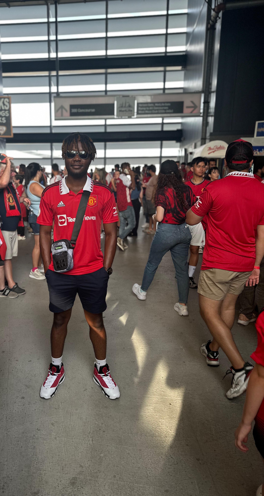

# About me
## Olamide Kumapayi

### My picture

  

### Computer Experience
I’m a computer science major. I spent the summer as a software engineering intern at Sonos where I was on the cloud platform team, and  I had to create a control integration sample app using React. The app aimed to show external developers how to integrate Sonos API commands into their third-party apps. This was my first time using React or API commands, so that was a good experience. Also for my software engineering class, we decided to build a web-based POS system using PHP, HTML, and CSS. I worked on the shopping cart and payment sections. This was a collaborative work with 4 other colleagues.

### Practical application
I hope to use my knowledge from this course to improve my coding skills further. This would be the first time for me to use vue.js, and this would be a very valuable skill to take into the workforce. This would help me become a better programmer and hopefully land a good job after graduation. I also plan on taking the feedback from my internship, and applying it to this course, and hopefully by the end of this course, I’m a better programmer.

### Don't forget your .env files. You can't see them here, but you need them. Those values also belong in your environment variables of any hosting solution that you use.